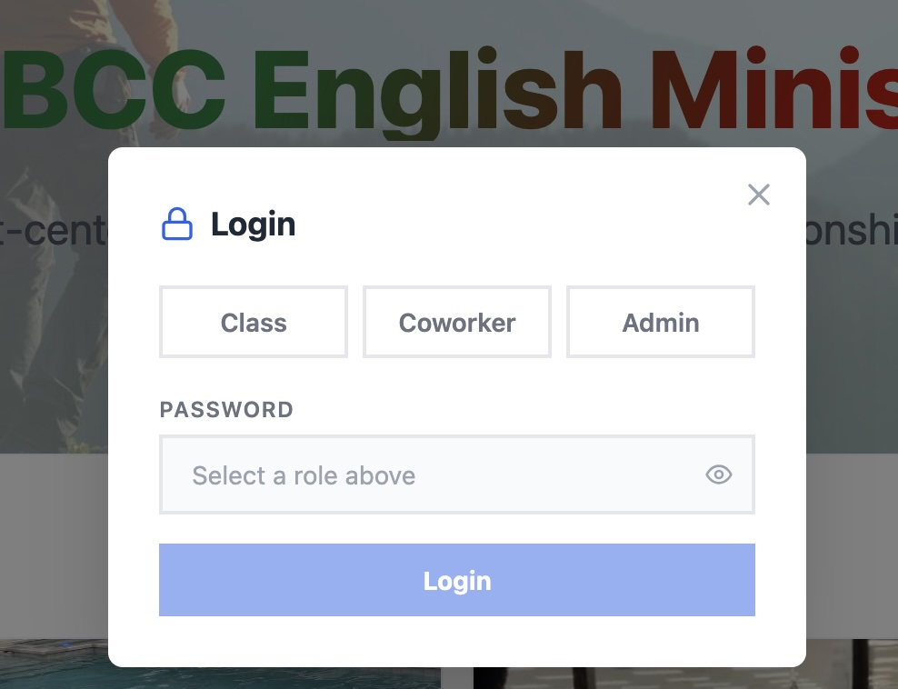
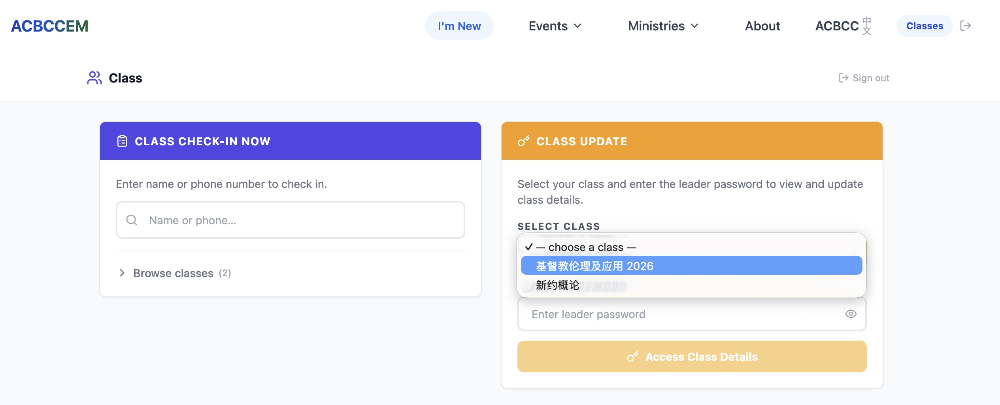
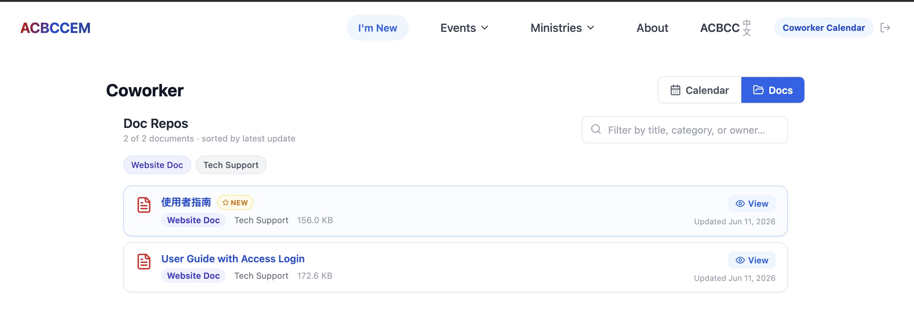

# ACBCC English Ministry — User Guide

This guide explains the three login roles available in the ministry portal, what each role can do, and how passwords are managed.

---

## Login Roles Overview

There are three login roles, each serving a different area of ministry administration:

| Role         | Purpose                                               |
| ------------ | ----------------------------------------------------- |
| **Class**    | Class leaders managing attendance and class resources |
| **Coworker** | Ministry coworkers viewing the monthly duty schedule  |
| **Admin**    | Full system administration                            |

Each role has its own password. On the login screen, select your role from the dropdown and enter the corresponding password.

> Sessions automatically expire after 40 minutes of inactivity. You will be redirected to the login page and must log in again.

---

## Class Role

Intended for **class leaders and teachers** who manage a Bible study or education group.

### What the Class Role Can Do

- **View and manage classes** — access only active classes assigned to you
- **Track attendance** — check in members for each class session and record who attended
- **Manage class sessions** — create sessions, record topics, and add session notes
- **Maintain a class roster** — add members and track their attendance history
- **Search attendance history** — look up a person across all classes
- **Upload class resources** — attach documents to a class or specific session. These documents are viewable by all via Ministries -> Resouces on Menu Bar.
- **Receive email notifications** — if an unrecognized person checks in, the class leader is notified by email

### Class Leader Password

Each class can have its own **lead password** set by an Admin. This is not the same as the role-level password.

---

## Coworker Role

Intended for **ministry coworkers** who can view the full calendar. Also able to add New Event to calendar.

### What the Coworker Role Can Do

- **View the duty schedule** — see the monthly, weekly, and daily schedule calendar
- **Search the schedule** — look up specific dates or events across any time period
- **View church document repository** — these documents are uploaded by the Admin (announcements, resources, references, etc.)

### What the Coworker Role Cannot Do

- Coworkers cannot edit, add, or delete schedule event entries — available to Admin-only
- Coworkers cannot upload documents to the repository, view-only access.

---

## Admin Role

The Admin role has full access to all areas of the portal.

### What the Admin Role Can Do

Everything the Coworker role can do, plus:

#### Schedule Management

- **Add and edit events** — create new duty assignments, edit existing entries, or delete events from the calendar
- **event types** — remove event type
- **Manage teams** — remove team

#### Coworker Duty Reminder Emails

- **Send monthly reminders** — select any month and send personalized email reminders to every coworker who has duties scheduled that month
- Each email is addressed to the coworker by name and lists all their assigned duties with the date, event name, and task description
- The system will report back which emails were sent, which coworkers were skipped (not in the contacts database or no email on file), and any errors

#### Class Administration

- **Add new classes** — create classes with details such as name, leader, location, meeting schedule, and recurrence
- **Set the class lead password** — assign or update the lead password for an the class
- **Archive classes** — soft-archive a class when it is no longer active (does not delete history)

#### Church Document Repository

- **Upload documents** — add PDFs, Word, PowerPoint, Excel, images, video, and audio files (up to 100 MB) to the shared repository visible to all coworkers
- **Add external links** — attach YouTube links or external URLs as repository entries
- **Edit document metadata** — update the title, category, or owner name for any document
- **Delete documents** — remove documents from the repository

#### Congregation/Contacts Management

- **Add and edit contacts** — maintain the congregation member directory including photos
- **Delete contacts** — remove members from the directory

#### Password Management

- **Change role passwords** — update the login password for the Class, Coworker, or Admin role at any time

---

## Password Management

### Role Passwords

There are 3 roles passwords — Class, Coworker, and Admin. Same password per role.

- Only the **Admin** can change role passwords
- Role passwords should be changed periodically (e.g., every few months) to maintain security
- After a password is changed, share the new password with the relevant users directly — the system does not send automatic notifications when a role password changes

### Class Lead Passwords

Each class can have its own 'lead' password, separate from the Class role password. This password is set by the Admin and given to the class leader.

- Only the **Admin** can set or reset a class lead password
- A class leader should notify the Admin if they need their lead password reset
- Class lead passwords can be updated at any time or periodically.

### Security Recommendations

- Change role passwords periodically — at a minimum when a coworker or class leader leaves the ministry
- Do not share the Admin password with non-admin users
- The Admin password provides full access to all data and settings
